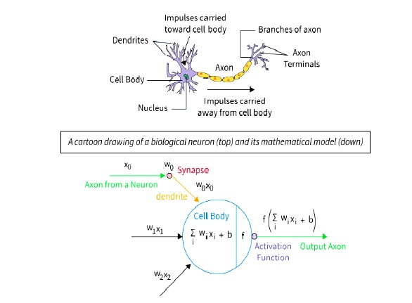
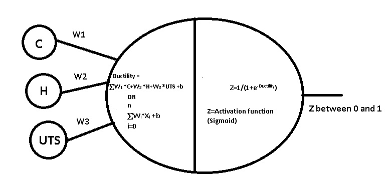
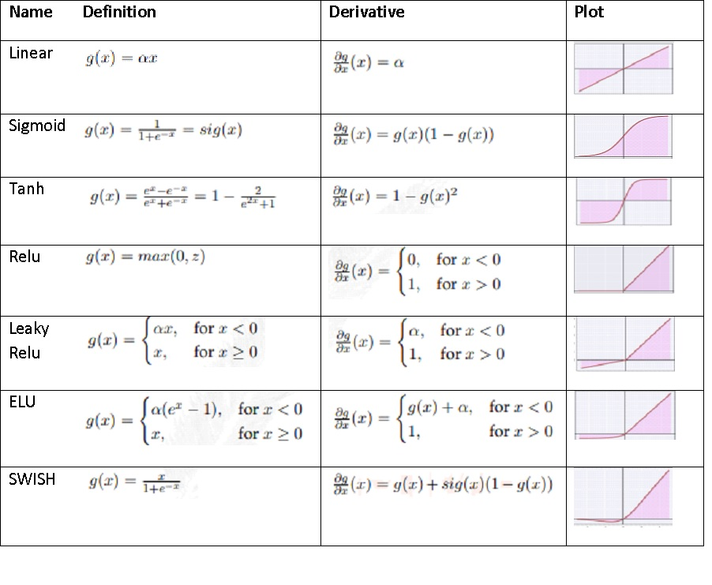
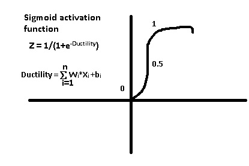
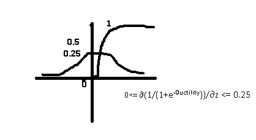
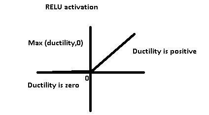

<h1> Asssignment 01 : Understanding and implementing of the activation functions</h1>
<b>THEORETICAL UNDERSTANDING</b> 
<b>ACTIVATION FUNCTIONS:</b>  Activation functions in Deep learning are mathematical formulas that determine how neurons in the network respond or activate when they receive a set of inputs  Without activation functions, a Neural Network wouldn't perform better than a Regression model. The activation function introduces non-linearity into the model. 
 
Neural Network is modeled after the Neurons in the brain. The brain receives a surplus of information, but not everything is useful or required, so the brain filters out information and only takes in the required information. Activation functions are the gates of a Neural network, allowing only useful information to pass through. 
For an example we are deciding a carbon steel rod is ductile or not using a deep learning model. The ductility is an important property of steel where the steel product is subjected to be bended without fracture. In the input layers we are feeding Carbon in percentages, hardness in Rockwell C scale and ultimate tensile strength in MPa as inputs of different carbon steels and ductility is the result in output layer as 0 and 1. Based on the inputs, the model will decide if the steel is ductile (1) or not (0). 
  
 
Without of application of activation function, sigmoid, we would end up with result analyzed by linear regression:
 <pre>Ductility=W1*C+W2*H+W3*UTS +b</pre>
 
 We can see that the output is a Linear equation and cannot perform well with non-linear data. Applying the Activation function enables the Network to perform much better. Activation functions can regulate the outputs of nodes and add a level of complexity that neural network without activation functions cannot achieve. 
 Non-linear activation functions allow the model to create a more complex mapping between the inputs and the outputs. That is an important issue when analyzing complex and high dimensional data, like images, video, audio. The criteria for an activation function are that it has to be continuous and (almost everywhere) differentiable such that it can be used in the process of back propagation.  
 <b>SOME COMMON ACTIVATION FUNCTIONS INCLUDE THE FOLLOWING: </b> 
1. The sigmoid function has a smooth gradient and outputs values between zero and one. For very high or low values of the  
input parameters, the network can be very slow to reach a prediction, called the vanishing gradient problem.  
2. The TanH function is zero-centered making it easier to model inputs that are strongly negative strongly positive or neutral. 
3. The ReLu function is highly computationally efficient but is not able to process inputs that approach zero or negative. 
4. The Leaky ReLu function has a small positive slope in its negative area, enabling it to process zero or negative values. 
5. The Parametric ReLu function allows the negative slope to be learned, performing backpropagation to learn the most effective 
slope for zero and negative input values.  
6. Softmax is a special activation function use for output neurons. It normalizes outputs for each class between 0 and 1, 
and returns the probability that the input belongs to a specific class.  
7. Swish is a new activation function discovered by Google researchers. It performs better than ReLu with a similar level of 
computational efficiency.  
The mathematical formulas and plots of different activation functions are summarized in the following table: 
   
 MATHEMATICAL EXPLORATION: 
    
  <pre>η = Learning rate, L= Loss
Ductility = [C*W1 + H*W2 + UTS*W3] + b1
C= % of carbon, H=Hardness in HRC C scale, UTS= ultimate tensile strength.
Z=activation function = sigmoid activation function = 1/(1+e-Ductility)
Loss=L= (Actual ductility-Predicted ductility)2 
</pre> 
   
If the prediction is less than 0.5, the neuron will not fire and the carbon steel will not be ductile, it will be brittle. If the prediction is greater than 0.5, the neuron will be activated and the property of steel will be predicted as ductile metal. 
By taking derivative of sigmoid function the range of prediction is between 0 and 0.25.
   
 Relu activation function: 
    
In the hidden layer relu activation function is utilized whereas sigmoid activation function is used in output layer.
